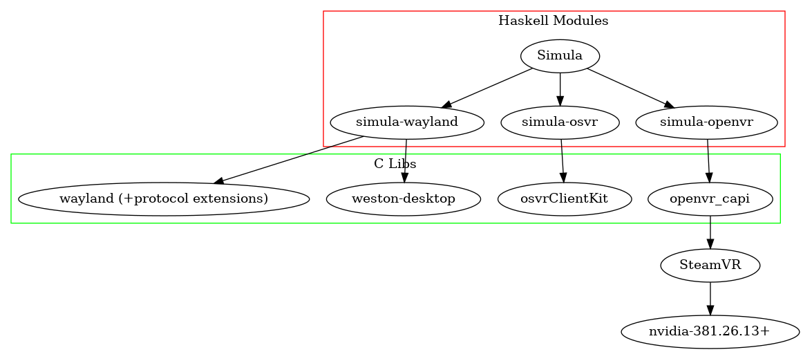

## 1 Code Overview

Here is the project's dependency graph:

- The top level of this project hosts the primary Haskell modules.

- The embedded submodules `simula-wayland`, `simula-osvr`, and `simula-openvr` contain FFI bindings (via c2hs) that connect to their respective C libraries shown above.

- In order to run the vive-compositor, you will need `nvidia-381.26.13` or greater installed on your system, which (unfortunately) `nix` cannot provide. You do not need nvidia drivers, however, to run the `base-compositor`.

## 2 Origins

Simula is a reimplementation fork of [motorcar](https://github.com/evil0sheep/motorcar). To read about motorcar, see *[Toward General Purpose 3D User Interfaces: Extending Windowing Systems to Three Dimensions](https://github.com/evil0sheep/MastersThesis/blob/master/thesis.pdf?raw=true)*.

## 3 How to Contribute

We're looking for open-source contributors. If you're interested in using Haskell to (cleanly) bring VR and Linux together, but don't have an HTC Vive, PM or email me at georgewsinger@gmail.com.

You can also see the this project's [Issues](https://github.com/georgewsinger/SimulaHS/issues) for a list of ways to immediately contribute. Issued may be tagged as "new contributor" if they are especially appropriate for people getting adjusted to the code. In addition, [TODO.md](./TODO.md) sketches some additional issues with the code that may be solved via future contributions.

**DISCLAIMER:** All pull requests to this repo implicitly consent to, and will be subsumed under the terms of the [LICENSE](./LICENSE).
