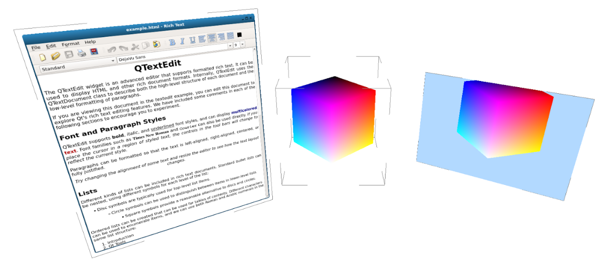

VR Linux Desktop
================

.. image:: https://badges.gitter.im/SimulaVR/Simula.svg
    :target: https://gitter.im/SimulaVR/Simula?utm_source=badge&utm_medium=badge&utm_campaign=pr-badge
    :alt: Gitter IM Badge

.. image:: https://readthedocs.org/projects/simulavr/badge/?version=latest
    :target: http://simulavr.readthedocs.io/en/latest/?badge=latest
    :alt: Documentation Status

* :ref:`user-docs`
* :ref:`build-docs`
* :ref:`dev-docs`

Here's a screenshot showing three different wayland client applications running under the simulavr weston compositor.

.. _user-docs:
.. toctree::
   :maxdepth: 2
   :caption: Users Guide

   simulavr
   contributing
   license

.. _build-docs:

.. toctree::
   :maxdepth: 2
   :caption: Building Simula

   git
   Nix_Build
   Ubuntu_Build

.. _dev-docs:

.. toctree::
   :maxdepth: 2
   :caption: Developer Documentation

   developer_overview
   Rendering_Roadmap
   origins
